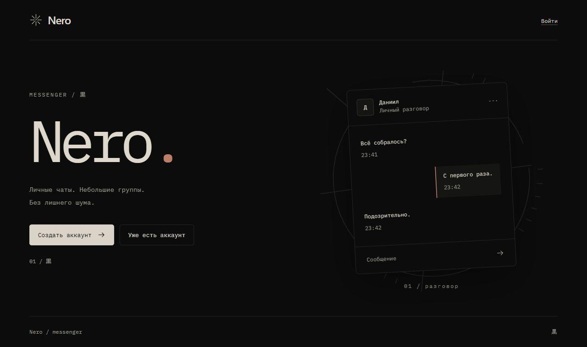
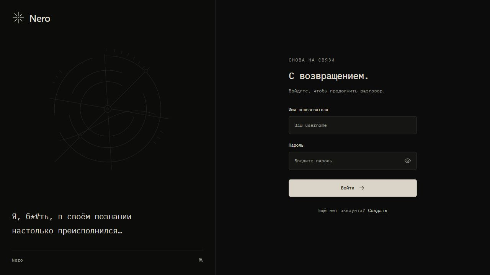

# Nero

[](https://nero.wrzdx.tech/)

[Live demo](https://nero.wrzdx.tech/) · [Frontend](docs/frontend.md) · [HTTP API](docs/http-api.md) · [Deployment](docs/deployment.md)

<details>
<summary>More screens — sign in</summary>



</details>

Nero is a messenger written in Go as a learning project. The
codebase focuses on explicit domain invariants, transaction boundaries,
concurrency safety, and integration-tested PostgreSQL repositories.

The **v1 functional scope** is implemented: accounts, direct and group chats,
text messages, read state, and live message notifications. This is an educational
MVP, not a claim of production readiness or a published version tag.

## Live deployment

- **Domain:** https://nero.wrzdx.tech/
- **HTTP API:** https://nero.wrzdx.tech/api/v1
- **WebSocket:** `wss://nero.wrzdx.tech/api/v1/ws`

Nero serves a homepage, registration/login, chats, user search, group management
and profile settings. Browser pages use HttpOnly session cookies; see the
[frontend notes](docs/frontend.md) and [deployment guide](docs/deployment.md).
Protected JSON routes require a Bearer access token. WebSocket authentication
uses the first message, as described in the [protocol](docs/websocket.md).

To check that the API is reachable:

```sh
curl -i https://nero.wrzdx.tech/api/v1/users/me
```

Without a token, the expected response is `401 Unauthorized` with error code
`invalid_token`, not a profile page.

The service runs in Docker behind Nginx with HTTPS. PostgreSQL is not exposed
publicly. This is a learning/demo deployment; do not use it for sensitive data
or rely on it for durable storage of important conversations.

## Documentation

- [HTTP API](docs/http-api.md): routes, request bodies, responses, and pagination.
- [WebSocket protocol](docs/websocket.md): authentication, events, and a browser example.
- [Database](docs/database.md): constraints and application-owned invariants.
- [Development](docs/development.md): configuration, setup, tests, and generation.
- [Nero frontend](docs/frontend.md): pages, templ, Tailwind, htmx, and asset builds.
- [Deployment](docs/deployment.md): release bundle, server update, checks, and rollback.

## Implemented

- Registration, login, refresh-token rotation, and logout.
- Stateful sessions stored in PostgreSQL.
- Password changes with compare-and-swap and session revocation.
- Case-insensitive usernames with display casing preserved.
- Prefix search by username; chat creation and participant management by username.
- Adaptive Nero UI, server-rendered with templ, Tailwind CSS and htmx.
- User profile reads and partial updates.
- Account anonymization with atomic session revocation.
- Row-level locking for profile updates, account deletion, and the final login
  check.
- One direct chat per user pair; group creation, title updates, participant
  listing, addition, removal, and non-owner departure.
- Text message sending with a client-generated retry key; author-only editing
  and deletion; cursor-paginated history in both directions.
- Read markers, unread counts, and chat previews with the last message.
- Authenticated WebSockets, multiple connections per user, and notifications
  for message creation, editing, and deletion.
- Unit tests, real WebSocket connection tests, and PostgreSQL integration tests.

## Stack

- Go 1.26.4
- Chi
- PostgreSQL 18
- pgx
- JWT access tokens and stateful refresh sessions
- coder/websocket
- templ, Tailwind CSS 4, htmx 4, and small browser-side JavaScript modules
- Docker Compose
- Zap
- Testify and Mockery

## Architecture

The repository uses a feature-first layout. Each feature owns its use cases,
transport contracts, and persistence implementation. Shared technical building
blocks and domain types live under `internal/core`.

```text
.
├── cmd
│   └── nero               # composition root and application entrypoint
├── internal
│   ├── core
│   │   ├── auth           # token, password, and cookie primitives
│   │   ├── domain         # entities, value objects, and invariants
│   │   ├── postgres       # pool, transactions, and pgx helpers
│   │   └── transport      # reusable HTTP infrastructure
│   ├── web                # HTML handlers and templ views
│   └── features
│       ├── auth           # credentials and session lifecycle
│       ├── users          # profiles and account lifecycle
│       ├── chats          # direct/group chats and participants
│       ├── messages       # history, sending, editing, deletion, read state
│       └── realtime       # WebSocket connections, hub, and notifications
├── docs                   # API documentation and database diagram
├── migrations             # ordered PostgreSQL migrations
├── web                    # styles, fonts, SVG assets, and browser scripts
├── deploy                 # production Compose, Nginx, and smoke checks
├── scripts                # asset hashes and release packaging
├── docker-compose.yaml
├── Makefile
└── README.md
```

Repository interfaces are declared by the consuming service. Transactions are
orchestrated by use cases and propagated to repositories through `context.Context`.
HTTP performs commands and queries. WebSocket notifications are sent after
successful persistence, outside the transaction.

## Database


The [schema notes](docs/database.md) explain composite uniqueness and which
cross-table rules are maintained by application code rather than SQL constraints.

## HTTP API

All routes are mounted under `/api/v1`.

| Method | Route | Authentication | Purpose |
| --- | --- | --- | --- |
| `POST` | `/auth/register` | No | Create a user and initial session |
| `POST` | `/auth/login` | No | Authenticate and create a session |
| `POST` | `/auth/refresh` | Refresh cookie | Rotate the refresh token |
| `POST` | `/auth/logout` | Refresh cookie | Revoke the current session |
| `PUT` | `/auth/password` | Access token | Change password and revoke sessions |
| `GET` | `/users/me` | Access token | Get the current user |
| `GET` | `/users/search` | Access token | Find users by username prefix |
| `GET` | `/users/{id}` | Access token | Get an active user |
| `PATCH` | `/users/me` | Access token | Partially update the profile |
| `DELETE` | `/users/me` | Access token | Anonymize the account and revoke sessions |
| `GET` | `/chats/` | Access token | List chat previews and unread counts |
| `POST` | `/chats/directs` | Access token | Create or return a direct chat |
| `POST` | `/chats/groups` | Access token | Create a group |
| `PUT` | `/chats/groups/{chat_id}` | Access token | Update group title |
| `GET` | `/chats/groups/{chat_id}/participants` | Access token | List participants |
| `POST` | `/chats/groups/{chat_id}/participants` | Access token | Add participants |
| `DELETE` | `/chats/groups/{chat_id}/participants` | Access token | Remove participant / leave |
| `GET` | `/chats/{chat_id}/messages/` | Access token | Page through messages |
| `POST` | `/chats/{chat_id}/messages/` | Access token | Send a message |
| `PATCH` | `/chats/{chat_id}/messages/{message_id}` | Access token | Edit own message |
| `DELETE` | `/chats/{chat_id}/messages/{message_id}` | Access token | Delete own message |
| `PUT` | `/chats/{chat_id}/messages/read` | Access token | Advance read marker |
| `GET` | `/ws` | First WebSocket message | Upgrade to a notification connection |

Refresh tokens are stored in an `HttpOnly` cookie. Access tokens are returned
in the response body and supplied through the authorization middleware.

## Running locally

Requires Go 1.26.4, Node.js/npm, Docker Compose, GNU Make, and a POSIX-compatible shell
(for example Git Bash on Windows). The Makefile reads and exports `.env`:

```sh
cp .env.example .env
# Edit .env: replace the example JWT secret and database password.
make env-up
make env-port-forward
make migrate-up
npm ci
npm run build:ui
make run
```

With the example configuration, Nero is at `http://localhost:5050/` and the API
is at `http://localhost:5050/api/v1`. The application does not read `.env` itself;
export configuration first when running Go directly.

For local Docker startup, `make deploy` builds the UI and Go application, then
starts the `messenger` service. PostgreSQL and migrations remain separate steps.
This target is local; it does not update the remote domain.

## Tests

Run the unit suite:

```sh
make test-unit
go test -race ./internal/features/messages/service ./internal/features/realtime/transport/ws
```

Run PostgreSQL integration tests against the dedicated test database:

```sh
make env-up
make env-port-forward
make test-env-up
make test-migrate-up
make test-integration
make test-env-down
```

Integration tests use the `integration` build tag and execute against real
PostgreSQL constraints, transactions, and row locks.

Use a dedicated disposable test database: `make test-env-down` drops it with
`FORCE`. Passing unit tests does not substitute for testing migrations and the
complete running application.

## v1 boundaries

- WebSocket delivery is best effort, in-memory, and single-instance. There is no
  durable event log, replay, delivery acknowledgement, broker, or outbox.
- Only message create/edit/delete events are published. Read receipts, group
  changes, typing, presence, and online status have no live events yet.
- Refresh sessions are revocable; already-issued access JWTs are not immediately
  revoked. Existing sockets are bounded by access-token expiry, not logout.
- Role changes, ownership transfer, group deletion, attachments, and message search are
  outside the current scope.
- Some permission/account-state checks intentionally allow concurrent changes;
  not every authorization decision is strictly serialized.
- The demo deployment uses Docker, Nginx and TLS. Rate limiting, monitoring,
  backup/restore, and load testing remain separate work.
